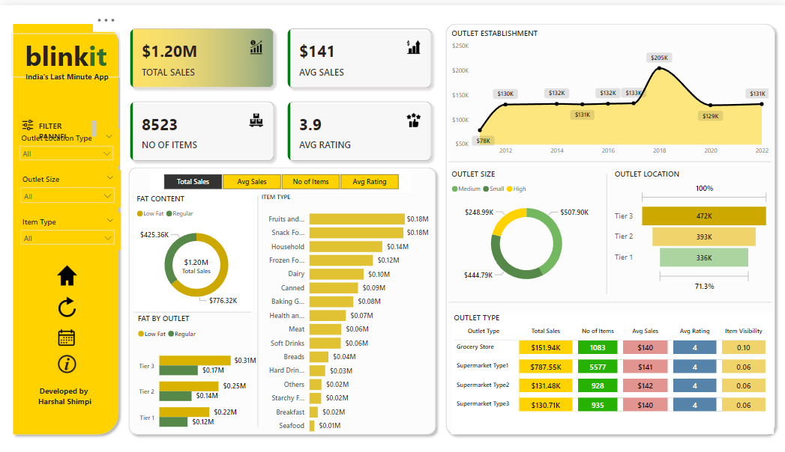

# Power BI Sales Dashboard

This repository contains a Power BI dashboard that analyzes sales data based on several key metrics.

## Objectives:
1. **Total Sales by Fat Content:** Analyzes the impact of fat content on total sales (Donut Chart).
2. **Total Sales by Item Type:** Identifies the performance of different item types in terms of sales (Bar Chart).
3. **Fat Content by Outlet for Total Sales:** Compares total sales across different outlets segmented by fat content (Stacked Column Chart).
4. **Total Sales by Outlet Establishment:** Evaluates the influence of outlet type/age on sales (Line Chart).
5. **Sales by Outlet Size:** Analyzes the correlation between outlet size and total sales (Donut/Pie Chart).
6. **Sales by Outlet Location:** Analyzes geographic distribution of sales (Funnel Map).
7. **All Metrics by Outlet Type:** Provides a comprehensive view of all key metrics by outlet type (Matrix Card).

## New Feature: Clear All Slicers Button
- A **Clear All Slicers** button has been added to the report, allowing users to quickly reset all slicers to their default values and clear any filtering applied across the report.

## Files:
- **Business Requirement**: https://github.com/HarshalShimpi027/Power-BI-Sales-Dashboard/blob/main/BUSINESS%20REQUIREMENT.pptx
- **Power BI File (.pbix)**: https://github.com/HarshalShimpi027/Power-BI-Sales-Dashboard/blob/main/Blinkit.pbix
- **Data Files**: https://github.com/HarshalShimpi027/Power-BI-Sales-Dashboard/blob/main/BlinkIT%20Grocery%20Data.xlsx

## How to Use:
1. Clone or download the repository.
2. Open the `.pbix` file in Power BI Desktop to view or modify the dashboard.
3. Optionally, publish the report to Power BI Service for online access.

## Screenshots:

